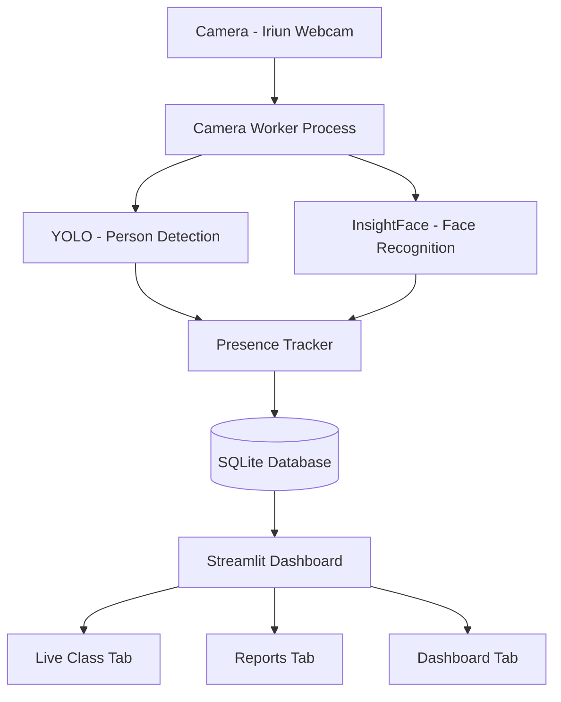
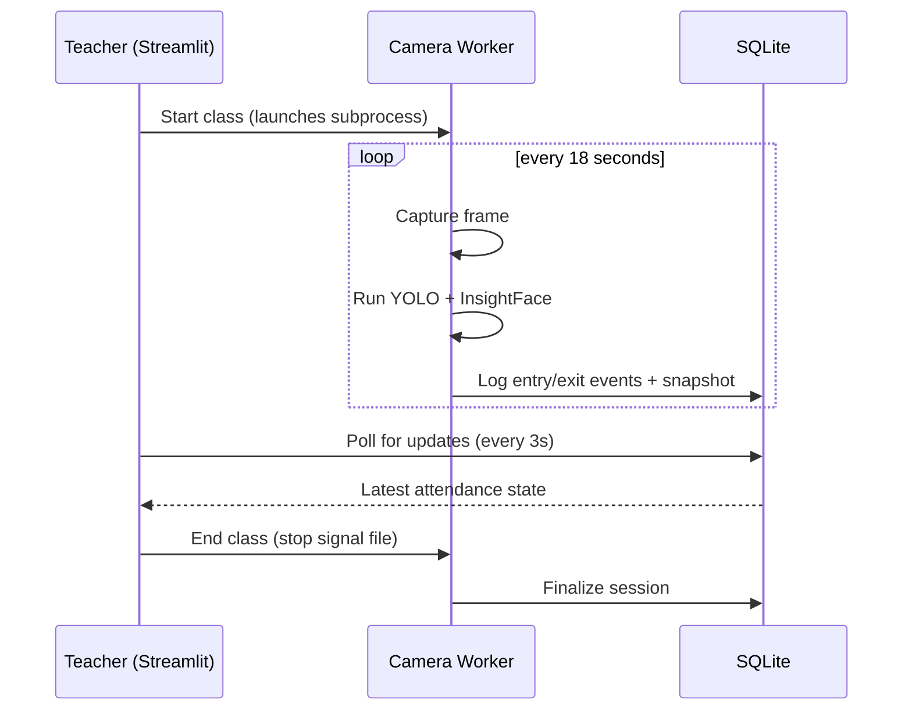

# Attendance System — Visual Modeling for Information

A local, privacy-conscious facial recognition attendance system for classrooms. Built to replace boolean roll-call ("present/absent") with real presence tracking — how long each student was actually in the room, including multiple entries and exits during the same class.

Developed as a Data Engineering & AI capstone project for the *Visual Modeling for Information* course at Universidad Politécnica de Yucatán (UPY).

---

## Table of contents

- [Overview](#overview)
- [Features](#features)
- [Architecture](#architecture)
- [Key technical decisions](#key-technical-decisions)
- [Known limitations](#known-limitations)
- [Tech stack](#tech-stack)
- [Installation](#installation)
- [Usage](#usage)
- [Project structure](#project-structure)
- [License](#license)

---

## Overview

The system uses two machine learning models — **InsightFace** for face recognition and **YOLO** for person detection — combined with a lightweight presence-tracking layer to automate classroom attendance. It runs entirely on a single local machine (no server, no cloud dependency), using a laptop webcam or a phone camera connected via [Iriun Webcam](https://iriun.com/).

Three views serve three different decision-making moments, as required by the course brief:

| View | Audience | Purpose |
|---|---|---|
| **Live Class** | Teacher, during class | Real-time presence status, who's in the room right now, live detection counts |
| **Reports** | Teacher, after class | Per-student and per-group attendance trends across the course |
| **Dashboard** | Teacher / coordinator | Quick overview per group, low-attendance alerts, student management |

---

## Features

- Face recognition-based attendance, matched against enrolled student photos
- Real presence tracking: entry/exit events, not a single boolean per class
- Two ML models working together: InsightFace (identity) + YOLO (person count, as a cross-check signal)
- Live dashboard with a donut chart, a time-present bar chart, and an entry/exit timeline
- Student photo grid with a green/red border showing current presence
- Historical reports: group comparison, individual trends vs. group average
- Student enrollment directly from the UI (file upload or webcam capture)
- Dark, minimal UI theme applied consistently across all views

---

## Architecture



**Why a separate worker process?** Streamlit re-runs its script on every UI interaction. Running face recognition inline would freeze the interface every few seconds. The camera worker runs as an independent subprocess, launched by Streamlit when a class starts: it owns the camera, runs both ML models on a fixed interval, and writes results directly to the database. Streamlit only ever reads — polling the database every few seconds via `st.fragment(run_every=...)` — so the UI stays responsive regardless of how long inference takes.



---

## Key technical decisions

| Decision | Choice | Why |
|---|---|---|
| Database | SQLite (WAL mode) | Single local writer (worker) and reader (Streamlit); no need for a networked database server. WAL mode lets both processes access the database concurrently without blocking. |
| Data layer | SQLAlchemy Core (not the full ORM) | Type-safe query building without the overhead of the ORM's session/identity-map machinery, which this schema's size doesn't need. Also makes a future migration to PostgreSQL straightforward. |
| Face recognition | InsightFace (`buffalo_l`) | Best accuracy among evaluated options (InsightFace, DeepFace, MobileFaceNet) in empirical testing on this hardware; matches the project's priority of minimizing student misidentification. |
| Second ML model | YOLO (`yolo11n`, person detection) | Complements face recognition by counting people regardless of face visibility, surfacing cases where someone is present but not identifiable from their current angle. |
| Recognition frequency | Every 18 seconds, not every frame | Running inference on every video frame would be unnecessary and CPU-intensive; attendance tracking doesn't need frame-level granularity. |
| Exit tolerance | 3 consecutive missed detections (~54s) before marking a student absent | Avoids false "exit" events from a single missed detection (e.g. someone briefly turning away). |
| Match threshold | Cosine similarity ≥ 0.45 | Empirically validated: same-person photo pairs scored ~0.73, different-person pairs scored ~-0.02 in testing — 0.45 leaves a wide safety margin against misidentification. |
| No live video feed in the UI | Snapshot-only, evaluated and descoped | Continuous video with real-time overlays was considered but would require running both ML models at a much higher frequency, with unvalidated performance impact on lower-end hardware — rejected in favor of the periodic-snapshot architecture already validated. |

---

## Known limitations

- **No authentication.** The MVP assumes a single teacher; multi-teacher support would require adding a login system before production use.
- **Single camera per session.** Multiple camera angles for one classroom were evaluated and intentionally descoped — deduplicating students seen by multiple cameras adds significant complexity for a marginal accuracy gain at this scale.
- **Deleting a student deletes their attendance history.** SQLite's foreign key constraints don't allow leaving orphaned event records, so student deletion is destructive and irreversible by design — intended for correcting test data, not for removing real students with real history.
- **Institutional photos are not part of the enrollment pipeline.** A student enrolled through the UI has face embeddings for recognition, but their institutional photo (used only in the Live Class photo grid) must be added manually.
- **No remote/cloud access.** The system is fully local, tied to the machine running the camera. Remote access was evaluated and descoped, since it would require re-architecting how the camera feed is captured.

---

## Tech stack

- **Language & tooling:** Python 3.11, [uv](https://docs.astral.sh/uv/)
- **Computer vision:** OpenCV, InsightFace, Ultralytics YOLO
- **Data layer:** SQLAlchemy Core, SQLite
- **UI:** Streamlit, Plotly

---

## Installation

Requires Python 3.11 and [uv](https://docs.astral.sh/uv/getting-started/installation/) installed.

```bash
git clone https://github.com/Mawit0/attendance-system.git
cd attendance-system

uv sync
```

This installs all dependencies, including InsightFace and YOLO — the required model weights are downloaded automatically the first time each model runs.

### Camera setup

The system expects a webcam accessible via OpenCV. If using a phone as the camera via [Iriun Webcam](https://iriun.com/), confirm which camera index it maps to on your machine:

```bash
uv run python -c "
import cv2
for i in range(4):
    cap = cv2.VideoCapture(i, cv2.CAP_AVFOUNDATION)
    if cap.isOpened():
        ret, frame = cap.read()
        print(f'Index {i}: available, brightness {frame.mean():.1f}' if ret else f'Index {i}: no frame')
        cap.release()
"
```

Update `CAMERA_INDEX` in `src/attendance/capture/worker.py` to match.

### Database initialization

```bash
uv run python scripts/init_database.py
```

### Seed base data (teacher, subject, groups)

Edit `scripts/seed_base_data.py` with your own teacher name and subject, then run:

```bash
uv run python scripts/seed_base_data.py
```

### Enroll students

Place student photos under `data/student_photos/<FULL_NAME>_<STUDENT_ID>/`, then run:

```bash
uv run python scripts/run_enrollment.py
```

Alternatively, students can be added one at a time from the Dashboard tab once the app is running.

---

## Usage

```bash
uv run streamlit run app/streamlit_app.py
```

- **Live Class** — select a group, click "Start class" to launch the camera worker. Attendance updates automatically every few seconds. Click "End class" to finalize the session.
- **Reports** — view group-wide comparisons or drill into a single student's attendance trend.
- **Dashboard** — see a quick summary per group, low-attendance alerts, and add or remove students.

---

## Project structure

```
attendance-system/
├── src/attendance/
│   ├── db/              # Schema, connection, and all queries (SQLAlchemy Core)
│   ├── enrollment/       # Embedding generation and student registration
│   ├── recognition/      # Face matching, person detection, frame annotation
│   ├── tracking/          # Presence state machine (entry/exit logic)
│   ├── capture/           # Camera worker process
│   └── reports/           # Attendance metric calculations
├── app/
│   ├── streamlit_app.py  # Entrypoint, three-tab layout
│   ├── theme.py           # Shared visual theming
│   └── tabs/               # Dashboard, Live Class, Reports
├── scripts/               # One-off setup and seeding scripts
└── data/                   # SQLite database, photos, embeddings (gitignored)
```

---

## License

MIT — see [LICENSE](LICENSE).